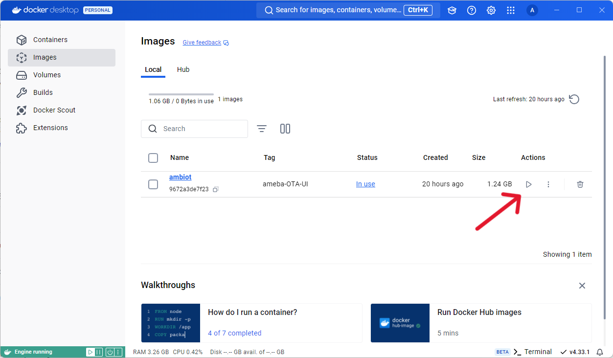
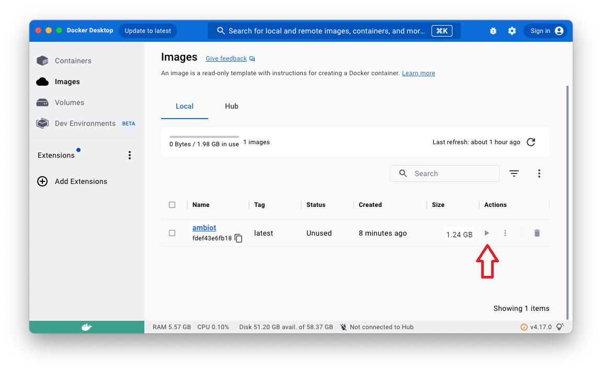

# ameba-OTA-UI

This README provides instructions on how to set up and run the ameba-OTA-UI. Currently it works for Ubuntu 22.04, Arduino SDK.

## Environment Setup

1. Clone this repository

   ```sh
   git clone https://github.com/Ameba-AIoT/ameba-OTA-UI.git
   ```

2. Install curl (if you haven't) and nvm

   ```sh
   sudo apt install curl
   curl -o- https://raw.githubusercontent.com/nvm-sh/nvm/v0.39.7/install.sh | bash
   ```

3. Export nvm path

   ```sh
   export NVM_DIR="$([ -z "${XDG_CONFIG_HOME-}" ] && printf %s "${HOME}/.nvm" || printf %s "${XDG_CONFIG_HOME}/nvm")"
   [ -s "$NVM_DIR/nvm.sh" ] && \. "$NVM_DIR/nvm.sh"
   ```

4. Install a specific Node.js version (e.g., v18.20.3) and a specific npm version (during time of development, node: 18.20.3, npm:10.8.1. This may work for other versions of node and npm) :

   ```sh
   nvm install v18.20.3 
   npm install npm@10.8.1 -g
   ```

5. Check the installed Node.js and npm versions:
   ```sh
   node -v
   npm -v
   ```

## Install Dependencies
  ```sh
   cd ameba-OTA-UI/
   npm i
   ```

## Running the Project
1. To create a production build and run the server:
   ```sh
   npm run build
   npm start
   ```

## Running the Project in a Docker Container
[//]: # ( #TODO: Keep links and other references in this section updated. )

If you are already familiar with using Docker, use the [`Dockerfile`](./Dockerfile) provided to build the project and run it in a Docker container.

Otherwise, read our guide for running the project in a Docker container on your preferred operating system:

- [Linux](#docker-on-linux)
- [Windows](#docker-on-windows)
- [macOS](#docker-on-macos)


### Docker on Linux
<details><summary><h4>Installing Docker on Linux</h4></summary>

[DigitalOcean's guide to setting Docker up](https://www.digitalocean.com/community/tutorials/how-to-install-and-use-docker-on-ubuntu-22-04) is easy to follow and includes instructions for Ubuntu, Debian, CentOS, and other Linux distros.

</details>

With Docker installed:

1. Download the Dockerfile:
   ```
   curl -LJO https://github.com/Ameba-AIoT/ameba-OTA-UI/raw/main/Dockerfile
   ```

2. Build the Docker container:
   ```
   docker build -t ameba-ota-ui ./
   ```

3. Run the Docker container:
   ```
   docker run --name ameba-OTA-UI -d -p 3000:3000 ameba-ota-ui
   ```

4. The OTA UI should appear when you visit `http://localhost:3000` in your browser. Verify that it works for other devices on your network by using another computer or mobile phone to visit `http://[the ip address of your server]:3000`.

   > If you cannot access the OTA UI from another device, you may need to allow connections to port 3000. In Ubuntu, you can do this by running:
   > ```
   > ufw allow 3000
   > ```

5. To stop the container run:
   ```
   docker stop ameba-OTA-UI
   ```

6. To start the container again run:
   ```
   docker start ameba-OTA-UI
   ```

7. If you need to rebuild the container (such as when updating the OTA UI), use the `--no-cache` flag to rebuild it:
   <pre><code>docker stop ameba-OTA-UI
   docker rm ameba-OTA-UI
   docker build <b>--no-cache</b> -t ameba-ota-ui ./
   docker run --name ameba-OTA-UI -d -p 3000:3000 ameba-ota-ui</code></pre>

### Docker on Windows
#### Using Docker Desktop

1. Download the Docker Desktop application from [the official website](https://www.docker.com/products/docker-desktop/) and install it.

2. Download the [`Dockerfile`](./Dockerfile) and save it to your project folder or whatever location you prefer.

3. Open a command prompt or Terminal window where the `Dockerfile` is stored and build the project:
   ```
   docker build -t ameba-ota-ui ./
   ```
4. Open the Docker Desktop GUI, go to the Images tab, and click the Run button.
   

5. If prompted, allow Docker Desktop access through the Windows Firewall.

6. If you need to rebuild the container (such as when updating the OTA UI), use the `--no-cache` flag to rebuild it:
   <pre><code>docker build <b>--no-cache</b> -t ameba-ota-ui ./</code></pre>

#### Advanced: Using Docker on WSL
>**Warning:** Running Docker on WSL may not be ideal if you aren't aware of its limitations and aren't willing to troubleshoot issues.
>
>If you are not confident of the above, we highly recommend using the Docker Desktop method instead.

<details><summary><h5>For Windows 11 Version 22H2 or newer</h5></summary>

Microsoft recommends setting your networking mode to `mirrored` if you are running WSL2 on Windows 11 version 22H2 or newer.

1. Enable mirrored networking by adding this line to your `.wslconfig` file:
   ```
   networkingMode=mirrored
   ```

2. Configure the Hyper-V firewall to allow inbound connections. In a PowerShell window with admin privileges run either of these commands:

   * **Option 1:** Allow all inbound connections:
      ```
      Set-NetFirewallHyperVVMSetting -Name '{40E0AC32-46A5-438A-A0B2-2B479E8F2E90}' -DefaultInboundAction Allow
      ```
   * **Option 2:** Limit inbound connections to port `3000` (the default port for the Ameba OTA UI):
      ```
      New-NetFirewallHyperVRule -Name "ameba-OTA-UI" -DisplayName "Ameba OTA UI" -Direction Inbound -VMCreatorId '{40E0AC32-46A5-438A-A0B2-2B479E8F2E90}' -Protocol TCP -LocalPorts 3000
      ```

3. Run an internet speed test inside your WSL virtual
   machine. This is optional but highly recommended, as multiple issues have been reported of mirrored networking being slow (e.g. microsoft/WSL issues [#4901](https://github.com/microsoft/WSL/issues/4901), [#11173](https://github.com/microsoft/WSL/issues/11173), [#10632](https://github.com/microsoft/WSL/issues/10632)).

   Use this command to test your speed:
   ```
   curl https://raw.githubusercontent.com/sivel/speedtest-cli/master/speedtest.py | python -
   ```
   > **Note:** The Docker build may fail if the virtual machine's internet access is slow or unstable. Try the [NAT method](#for-windows-11-versions-prior-to-22h2) instead if you face this issue.
   >
   >You may also build the container in NAT mode and then switch to mirrored to run it without having to mess with port forwarding.

4. Follow the [Linux](#docker-on-linux) guide above to build and run the project, skipping the UFW step if not applicable.

</details>

<details><summary><h5>For Windows 11 Versions prior to 22H2</h5></summary>

[//]: # ( Reserved for NAT-mode instructions to be created by the Ameba IoT team. )
[//]: # ( Note for the Ameba IoT team: Just like mirrored mode, NAT mode can also be affected by internet speed issues on some setups. Please advise users to run `netsh int ipv4 set interface "Wi-Fi" forwarding=enable` if their internet is too slow and their docker build fails. )

</details>

### Docker on macOS
Docker Desktop is the recommended way to run Docker containers on macOS, which is what the guide below focuses on. If you prefer the CLI-only version of Docker, [Colima](https://github.com/abiosoft/colima) is a great place to start.

> **Note:** At some point during the process below, you will be prompted to grant privileged access to Docker Desktop.

1. Download the Docker Desktop application from [the official website](https://www.docker.com/products/docker-desktop/) and install it.

2. Download the Dockerfile:
   ```
   curl -LJO https://github.com/Ameba-AIoT/ameba-OTA-UI/raw/main/Dockerfile
   ```

3. Build the Docker container:
   ```
   docker build -t ameba-ota-ui ./
   ```

4. Open the Docker Desktop GUI, go to the Images tab, and click the Run button.
   

5. If you need to rebuild the container (such as when updating the OTA UI), use the `--no-cache` flag to rebuild it:
   <pre><code>docker build <b>--no-cache</b> -t ameba-ota-ui ./</code></pre>